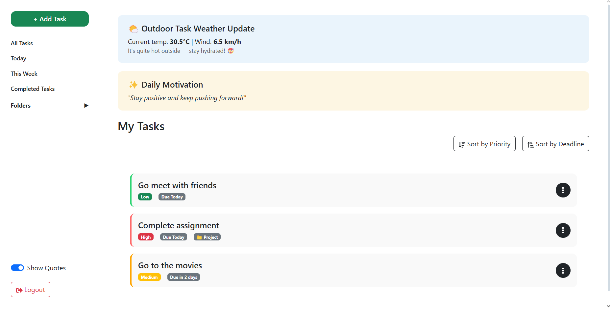

# To-Do Task Manager Web App  

A fully responsive task management web app built with React, Redux, and Bootstrap.  
It allows users to manage tasks with priorities, deadlines, folders, and motivational quotes with a clean UI and mobile-friendly design.  

## Features
- User authentication with Redux  
- Add, delete, and complete tasks  
- Task prioritization (High, Medium, Low)  
- Deadline tracking with overdue labels  
- Folder management (create and assign folders)  
- Sort tasks by priority or deadline  
- Outdoor task weather banner (dynamic)  
- Daily motivational quote banner (fetched from ZenQuotes API)  
- Fully responsive design  
- Mobile-friendly floating Add Task button  
- Sidebar with collapsible folders and toggle switches  
- Custom dropdown for task actions (complete or delete)  

## Tech Stack
- React.js  
- Redux Toolkit  
- React-Bootstrap  
- React-Router-Dom  
- React-Icons  
- React-Toastify  
- Axios (for fetching quotes)  
- CSS media queries for responsiveness  

## Screenshots  

### Login Page  
  

### Dashboard  
  

### Add Task Modal  
  

### Task Views  
#### All Tasks  
  

#### Today View  
  

#### This Week View  
  

#### Completed Tasks View  
  

#### Folders
  

## How to Run Locally
```bash
git clone https://github.com/Reizhea/To-Do-App.git
cd To-Do-App
npm install
npm start

